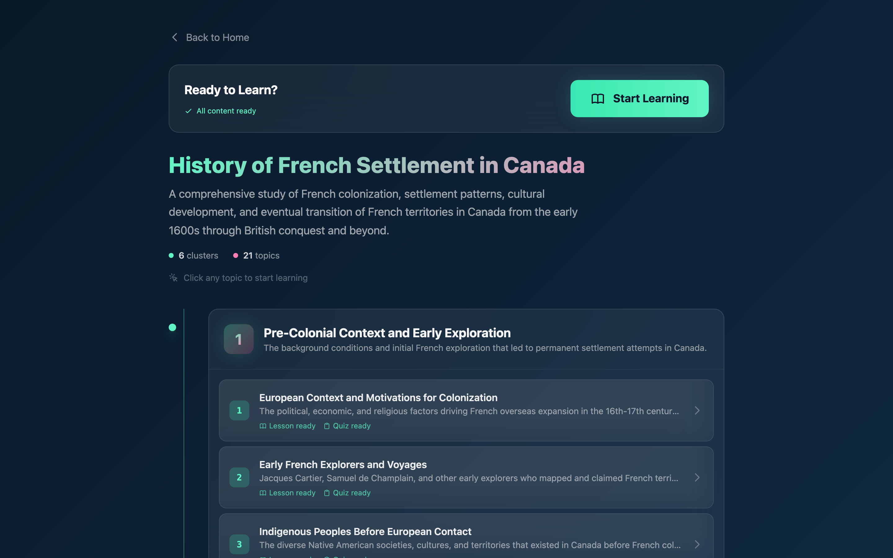
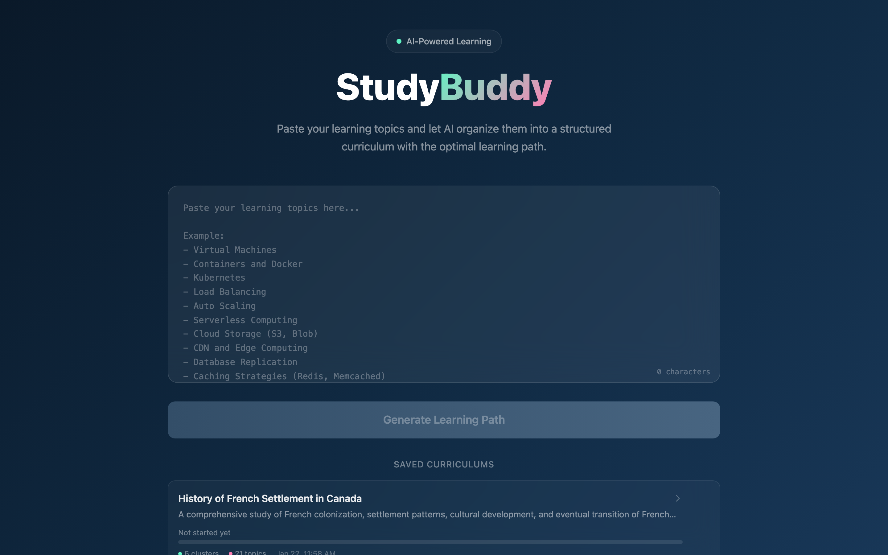
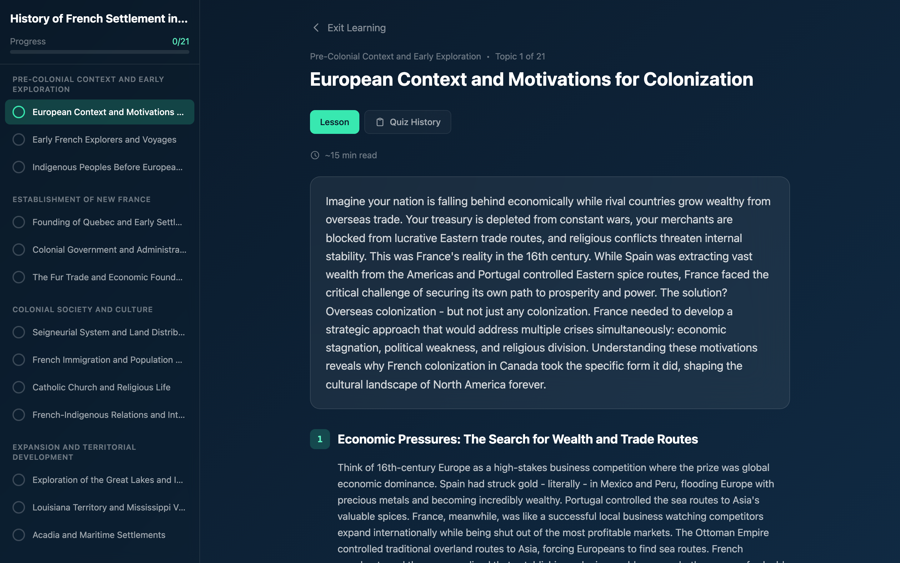
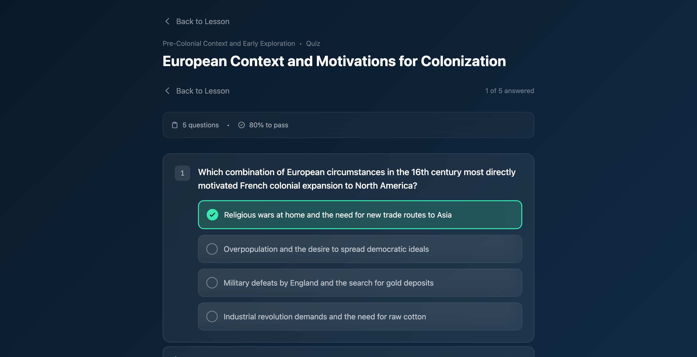

<div align="center">

# 📚 Study Buddy

**Paste your learning topics — get a structured curriculum with AI-generated lessons and quizzes.**



</div>

## Features

- **Curriculum generation** — paste a list of topics and Claude organizes them into an ordered learning path (streamed live over SSE)
- **One-click content preparation** — batch-generate every lesson and quiz for a curriculum up front, with live progress
- **Interactive lessons** — markdown lessons with problem/solution framing and a topic sidebar
- **Mastery quizzes** — per-topic quizzes with an optional **AI grading** toggle; without an API key, grading falls back to deterministic scoring
- **Progress tracking & quiz history** — completion tracking per topic and reviewable past quiz attempts

## Screenshots

| | |
|:---:|:---:|
|  |  |
| *Paste topics to generate a learning path* | *Lessons with topic sidebar and progress* |
<div align="center">


*Mastery quizzes with optional AI grading*
</div>

## Quick Start

An `ANTHROPIC_API_KEY` is **optional**: the app runs without one (browsing, lessons, quizzes, and fallback grading all work on already-generated content), but generating *new* curricula/content and AI grading require it.

### Docker Compose

```bash
echo "ANTHROPIC_API_KEY=your_api_key_here" > .env
docker-compose up -d
```

- Frontend: http://localhost:5173
- Backend API: http://localhost:8000

Data persists in `./data` (mounted to `/app/data` in the backend container).

### Local development

**Backend** (Python 3.10+):

```bash
cd backend
python -m venv venv && source venv/bin/activate
pip install -r requirements.txt
export ANTHROPIC_API_KEY=your_api_key_here   # optional, see above
uvicorn app.main:app --reload                # http://localhost:8000
```

**Frontend** (Node 18+):

```bash
cd frontend
npm install
npm run dev                                  # http://localhost:5173
```

<details>
<summary><strong>LAN access (e.g. testing from other devices)</strong></summary>

Bind the backend to all interfaces and open up CORS:

```bash
ALLOWED_ORIGINS=* uvicorn app.main:app --reload --host 0.0.0.0
```

The API is then reachable at your machine's LAN IP (e.g. `http://192.168.x.x:8000`). `ALLOWED_ORIGINS=*` enables CORS for all origins — for anything beyond local testing, list exact origins instead:

```bash
ALLOWED_ORIGINS=http://localhost:5173,http://192.168.1.50:5173 uvicorn app.main:app --host 0.0.0.0
```

</details>

## Configuration

| Variable | Description | Required |
|----------|-------------|----------|
| `ANTHROPIC_API_KEY` | Enables curriculum/lesson/quiz generation and AI grading | No — content browsing and fallback grading work without it |
| `ALLOWED_ORIGINS` | Comma-separated CORS origins (or `*`) | No — defaults to `http://localhost:5173` |
| `FRONTEND_PORT` | Port used to build the default CORS origins | No — defaults to `5173` |

> The frontend calls the API at `http://localhost:8000` (hardcoded in `frontend/src/api.ts`).

## API

<details>
<summary><strong>Endpoints</strong></summary>

### Curriculum
- `POST /api/parse/stream` — parse topics into a curriculum (SSE)
- `GET /api/curriculums` — list saved curriculums
- `GET /api/curriculums/{id}` — get a curriculum
- `DELETE /api/curriculums/{id}` — delete a curriculum
- `GET /api/curriculums/{id}/content-status` — which lessons/quizzes are cached
- `POST /api/curriculums/{id}/prepare` — batch-generate all lessons & quizzes (SSE)

### Learning
- `POST /api/lesson` — get or generate a lesson
- `POST /api/quiz` — get or generate a quiz
- `POST /api/quiz/new` — force-generate a new quiz version
- `GET /api/quiz/{id}/{cluster}/{topic}/{version}` — get a specific quiz version
- `POST /api/quiz/submit` — submit answers (AI or fallback grading via `use_ai_grading`)
- `GET /api/assessments/{id}/{cluster}/{topic}` — past assessments for a topic
- `GET /api/history/quiz/{id}/{cluster}/{topic}` — quiz history for a topic

### Progress & misc
- `GET /api/curriculums/{id}/progress` — learning progress
- `POST /api/curriculums/{id}/progress/start` — mark learning started
- `GET /api/status` — whether an API key is configured
- `GET /health` — health check

</details>

Data is stored as flat files under `backend/data/`: `curriculums.json`, `progress.json`, and `content/<curriculum_id>/{lessons,quizzes}/`.

## Project Structure

```
study-buddy-v2/
├── frontend/       # React 19 + TypeScript + Tailwind 4 (Vite)
│   └── src/        # pages/, components/, api.ts, types.ts
├── backend/        # FastAPI
│   └── app/        # main.py (routes), learning.py (AI generation),
│                   # curriculum_parser.py, storage.py, content_cache.py
├── ios/            # Native SwiftUI companion app (experimental — not production-bound)
├── docs/           # TESTING.md, screenshots
└── docker-compose.yml
```

## Tech Stack

- **Frontend:** React 19, TypeScript, Tailwind CSS 4, Vite 7, React Router 7
- **Backend:** FastAPI, Pydantic v2, Anthropic SDK (`claude-sonnet-4-20250514`)
- **Testing:** pytest, Vitest, Playwright

## Testing

```bash
cd backend && pytest tests/ -v      # backend
cd frontend && npm run test:run     # frontend
cd frontend && npm run test:e2e     # end-to-end (Playwright)
```

Full details — including running the real CI workflow locally with `act` and how E2E data seeding works — are in **[docs/TESTING.md](docs/TESTING.md)**.
